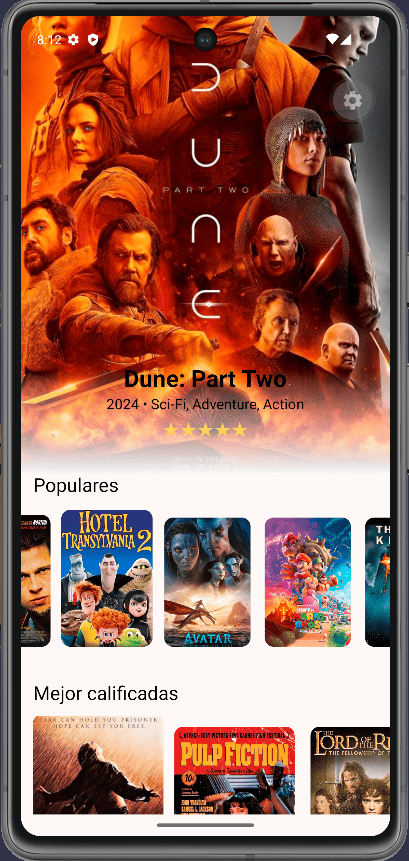
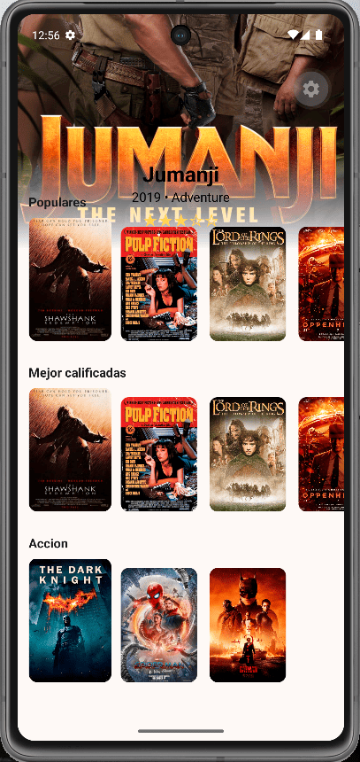

# Movies App

Aplicación móvil de películas con **React Native**, **Expo** y **Expo Router**.  
Consume la API de [DevsApiHub](https://devsapihub.com/docs/api-movies) y muestra un catálogo con hero destacado, carruseles horizontales, detalle por película y recomendaciones por género.

## Demo

<p align="center">
  
  
  
</p>

## Características

- **Home** con hero parallax, película destacada aleatoria y carruseles: Populares, Mejor calificadas y Acción.
- **Detalle** en `/movie/[id]` con poster, rating, géneros, sinopsis y carrusel de recomendadas.
- **Navegación** con Expo Router: stack raíz + rutas agrupadas `(tabs)` y `(movies)`.
- **UI** con [NativeWind](https://www.nativewind.dev/) (Tailwind CSS) y animaciones con [Reanimated](https://docs.swmansion.com/react-native-reanimated/).
- **Splash** animado al iniciar la app.

## Stack

| Tecnología | Uso |
|---|---|
| Expo SDK 56 | Runtime y tooling |
| Expo Router | Navegación file-based |
| TypeScript | Tipado estricto |
| NativeWind 4 | Estilos utility-first |
| Axios | Cliente HTTP |
| Reanimated | Parallax, carruseles animados |

## Estructura del proyecto

```
app/
├── _layout.tsx              # Stack raíz (tabs + detalle)
├── (tabs)/
│   ├── _layout.tsx          # Layout de tabs (tab bar oculta con una sola pantalla)
│   └── index.tsx            # Home → MoviesScreen
└── (movies)/
    ├── _layout.tsx          # Stack del grupo películas
    └── movie/[id].tsx       # Detalle → MovieDetail

src/
├── api/movies.ts            # fetchMovies, fetchMovieById, fetchMoviesByGenre, fetchRecommendedMovies
├── components/              # HeroBanner, MovieCarousel, MoviesScreen, MovieDetail, SplashLoading
├── navigation/routes.ts     # moviePath(id) → /movie/:id
├── types/movie.ts           # Movie, MovieApiItem
└── utils/stars.ts           # renderStars()
```

## Cómo correr el proyecto

### Requisitos

- Node.js 20+
- npm
- Expo Go (dispositivo físico) o emulador Android/iOS

### Instalación

```bash
git clone https://github.com/urian121/movies-app-react-native
cd movies-app-react-native
npm install
```

### Variables de entorno

```bash
cp .env-example .env
```

Contenido de `.env`:

```env
EXPO_PUBLIC_MOVIE_URL=https://devsapihub.com/api-movies
```

### Ejecutar

```bash
npx expo start -c
```

Luego presiona `a` (Android), `i` (iOS) o escanea el QR con Expo Go.

Scripts disponibles:

```bash
npm run android
npm run ios
npm run web
```

## Apoya el proyecto

Si este proyecto te fue útil, deja una estrella en el repositorio.  
¡Gracias por tu apoyo!
